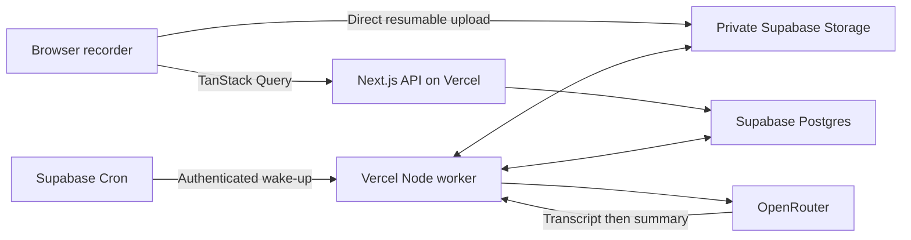

# Architecture

## Shape

One Next.js App Router project on Vercel, with Supabase Auth, Postgres, and private Storage. Use TypeScript, Tailwind CSS, and shadcn/ui. TanStack Query owns client-side server data and mutations. OpenRouter calls run only on the server.

Public pages are statically rendered where possible. The private app uses cookie-based Supabase SSR authentication, protected Route Handlers, and uncached per-user responses. No separate API service, vector DB, or real-time infrastructure is needed.

The durable job table and scheduled wake-up are proposed because processing must survive navigation, request failures, and deploys. This uses the chosen platforms without adding another queue service.

## Recording and upload

Use `getUserMedia` and `MediaRecorder` after a user action. Negotiate a supported codec rather than hardcoding one. Keep media handles in refs and recording state in React, outside TanStack Query. Derive elapsed time from a clock, not blob counts.

Persist ordered recording blobs and their metadata to IndexedDB while recording. On stop, wait for the final data event, assemble the complete file, and release all tracks. Interrupted recording recovery is best effort; a browser crash can leave an unfinalized container. Test recovery and show the real outcome.

Upload the completed file directly to Supabase with TUS and a deterministic owner/meeting path. Show progress and retain local data until the server confirms the file is finalized and the prepare job exists. Allow a local download if upload cannot complete. Clear the local copy after confirmation or explicit discard, and clear private caches on sign-out.

Do not send recording bytes through a Next.js API request. Vercel currently limits function request/response payloads to 4.5 MB; direct upload avoids that boundary. Supabase supports resumable uploads. [Vercel limits](https://vercel.com/docs/functions/limitations), [Supabase uploads](https://supabase.com/docs/guides/storage/uploads/resumable-uploads).

`MediaRecorder` timeslices are transport fragments, not guaranteed standalone audio files. Never transcribe arbitrary slices independently. Recorder timing can also drift when a device sleeps. [MDN recording events](https://developer.mozilla.org/en-US/docs/Web/API/MediaRecorder/dataavailable_event).

## Durable processing

Use a small Postgres `processing_jobs` table with atomic claim/lease functions. A Supabase Cron job calls a secret-protected Vercel Node Route Handler every minute. A best-effort wake-up after enqueue reduces waiting; Cron is the recovery mechanism. Return upload finalization only after its DB transaction commits. No long-running browser request is required.

Each worker invocation claims one eligible job using `FOR UPDATE SKIP LOCKED`, creates a unique lease token, increments attempts, and returns only after its result is persisted. Proposed Vercel `maxDuration`: 300 seconds; lease: 360 seconds. Bound work to 240 seconds and checkpoint before the deadline. A watchdog returns expired leases to retry, or marks them failed after the attempt limit. Completion writes must match the current lease token, so an old worker cannot overwrite a new one.

On enqueue and completion, a server-side dispatcher requests enough immediate worker wake-ups to fill a small concurrency limit, initially three jobs globally. Cron runs the same dispatcher as a fallback. Enforce that limit atomically during claiming, not by counting browser requests. This avoids waiting one minute between every audio segment while keeping provider load bounded. Respect per-user fairness and retry backoff.

Job stages:

1. **Prepare:** download only the expected Storage object, verify actual media format/duration/size, and use a bundled Linux-compatible FFmpeg/ffprobe in the Node runtime to create independently decodable audio segments. Start with roughly five-minute segments, codec-aware boundaries, and a small overlap. Keep the original audio unchanged. Persist segment files and metadata before enqueueing transcription jobs.
2. **Transcribe:** process a segment with OpenRouter, then save its text and available timing metadata. Use a 45-second provider timeout; tune segment length against the provider's execution limit. Retry transient network, 429, and 5xx failures with backoff, at most three attempts. Do not repeatedly retry invalid audio or credentials.
3. **Summarize:** after all segments succeed, assemble the full transcript in time order, deduplicating only actual overlapping text. Save that transcript before requesting a Markdown summary. Finish the meeting only after saving the summary.
4. **Delete:** remove original and derived files, then DB content. Retry safely on partial failure; deleted meetings must not reappear through worker writes.

Use deterministic segment keys and unique job keys per meeting/stage/segment. Save stage output and enqueue the next job in the same DB transaction. Object writes use stable keys and reconciliation because Storage and Postgres are not one transaction. Provider calls may still be billed twice after a crash; exactly-once billing is not promised.

FFmpeg packaging, cold-start time, full-size recording processing, overlap handling, and Vercel memory/temporary-disk limits are a mandatory early feasibility test. Do not ship a worker based only on a local success. Avoid server-side transcription of an hour-long file as one unbounded call. [OpenRouter STT](https://openrouter.ai/docs/guides/overview/multimodal/stt).

[Supabase Cron](https://supabase.com/docs/guides/cron) and [pg_net](https://supabase.com/docs/guides/database/extensions/pg_net) provide scheduled HTTP wake-ups. Store the worker credential in Vault. Keep job claiming and processing RPCs unavailable to browser roles.

## API contracts

All private routes verify the authenticated user server-side, validate inputs, and enforce ownership. Derive `user_id` from the session; never accept it as authority from the request body. Use UUIDs and server-generated object paths. Cookie-authenticated mutations validate same-origin requests. Never share-cache authenticated responses.

| Route | Contract |
| --- | --- |
| `GET /api/meetings?cursor=...` | Paginated metadata only, newest first |
| `POST /api/meetings` | Create draft using a client idempotency key; return ID and permitted upload path |
| `POST /api/meetings/:id/finalize` | Check owned object and size, atomically mark queued and insert prepare job; return `202`; duplicates return existing state |
| `GET /api/meetings/:id` | Return status, metadata, transcript Markdown, summary Markdown, and safe error details |
| `GET /api/meetings/:id/audio` | Return short-lived signed playback URL for an owned, non-deleting meeting |
| `PATCH /api/meetings/:id` | Rename only; recommended maximum 160 characters |
| `POST /api/meetings/:id/retry` | Requeue only failed/incomplete stages; bounded, rate-limited, idempotent |
| `DELETE /api/meetings/:id` | Tombstone and queue cleanup; return `202` |
| `POST /api/internal/process` | Secret-authenticated worker endpoint; no browser access |

Standard errors: `{ error: { code, message, retryable } }`. Use `401` for missing session, `404` for absent/unowned resources, `409` for invalid state, `413` for oversize media, and `429` for throttling. Do not expose raw provider responses or secrets.

## TanStack Query and UI

Use user-scoped query keys such as `['meetings', userId, filters]` and `['meeting', userId, id]`. Clear them on sign-out/account change. Wrap fetch requests in query functions and create/finalize/retry/delete in mutations. Auth redirects and TUS byte transfer use their own clients, with upload lifecycle coordinated by a mutation.

Poll only unfinished meetings, initially every three seconds while visible, with backoff when queued for longer. Refetch on focus and after mutations; stop polling terminal states. Read retries can be automatic; mutation retries require server idempotency. Never optimistically claim recording, upload, or processing success.

Render Markdown as data with raw HTML disabled and safe links; never compile it as MDX or execute embedded code. Block remote images in private meeting Markdown to avoid tracking requests. Summary comes first, transcript second, with accessible tabs or sections and a standard audio player.

Sources: [Supabase SSR](https://supabase.com/docs/guides/auth/server-side/creating-a-client?queryGroups=framework&framework=nextjs), [TanStack Query](https://tanstack.com/query/latest/docs/framework/react/overview), [shadcn/ui for Next.js](https://ui.shadcn.com/docs/installation/next).
